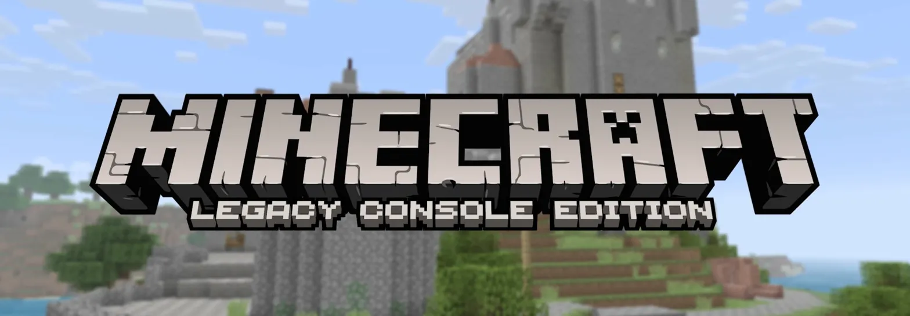

<p align="center">

</p>

<h1 align="center">Minecraft Legacy Console Edition — Key Binds</h1>
<p align="center">A custom keyboard remapper built for Minecraft Legacy Console Edition on PC</p>

---

## Features

- **Full keybind remapping** — click any bind and press any key or mouse button to reassign it
- **Mouse button support** — rebind to Left Click, Right Click, Middle Click, Mouse 4, Mouse 5
- **Scroll wheel support** — bind actions to Scroll Up or Scroll Down
- **Process-scoped remaps** — remaps only activate inside `Minecraft.Client.exe`, nothing else on your PC is affected
- **Original key blocked** — when you rebind W to X, pressing W does nothing in-game. Only X works
- **Per-row reset** — reset any single bind back to default with the Reset button next to it
- **Reset all** — one button to wipe every remap and go back to defaults
- **Auto-save** — any change you make is instantly saved to `settings/binds.ini`
- **Auto-load** — your saved binds are loaded and applied every time you open the script
- **Settings folder auto-created** — the `settings` folder is created automatically on first save, you don't need to make it
- **Minecraft-style UI** — custom font, textured background, and button assets pulled from the `media` folder
- **Smooth scrolling** — scroll through all binds with the mouse wheel, no flicker
- **Pinned header** — title stays locked at the top while you scroll
- **Pinned footer buttons** — Reset Keys and Done buttons scroll with the list and sit at the very bottom

---

## Folder Structure

```
📁 root
 ├── minecraft key binds.ahk
 ├── 📁 media
 │    ├── image_78e6e4.png
 │    ├── btn bind.png
 │    └── Minecraftia-Regular.ttf
 └── 📁 settings              ← auto-created on first bind change
      └── binds.ini
```

---

## Requirements

- [AutoHotkey v2](https://www.autohotkey.com/) installed
- Minecraft Legacy Console Edition running as `Minecraft.Client.exe`

---

## How to Use

1. Clone or download the repo
2. Make sure the `media` folder has all 3 files in it
3. Run `minecraft key binds.ahk`
4. Click any bind button and press the key you want
5. Press **Escape** to cancel a rebind
6. Your changes save automatically — just launch the script next time and everything is restored

---

<p align="center">Made by <strong>8vy2</strong></p>
